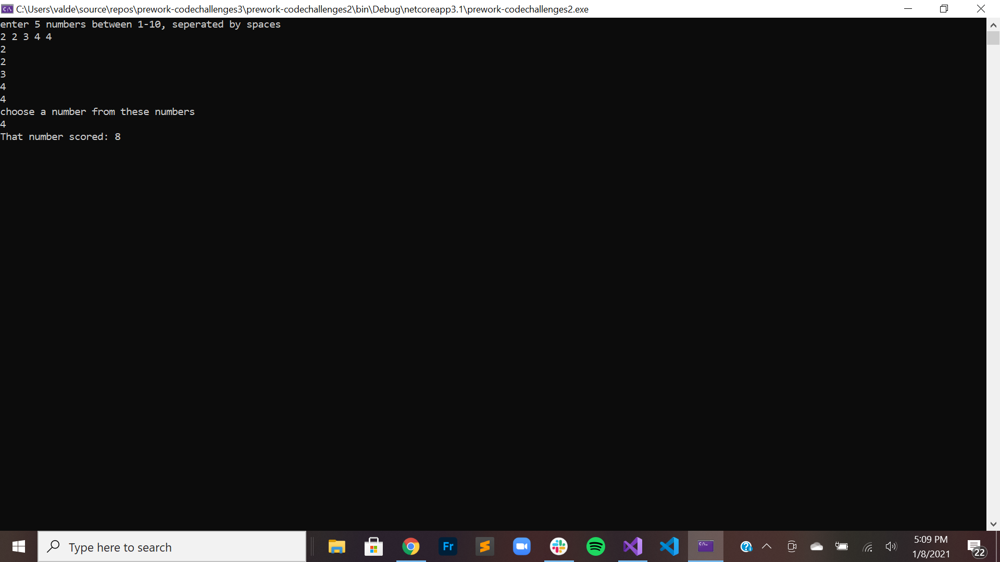
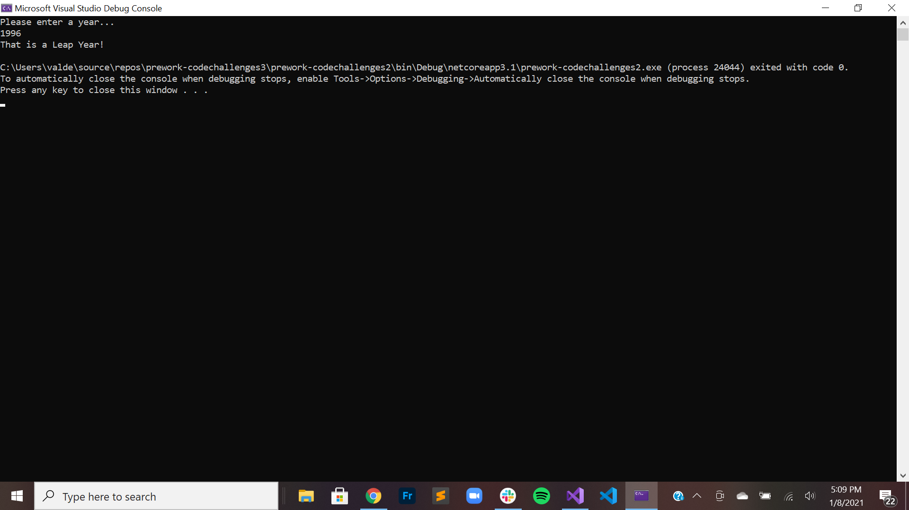
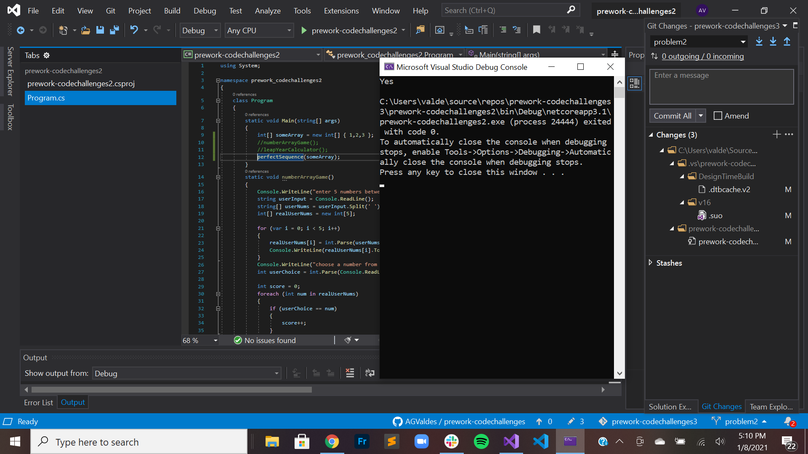
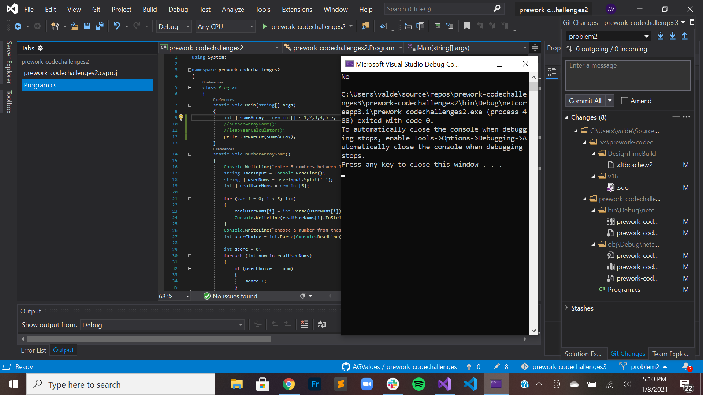
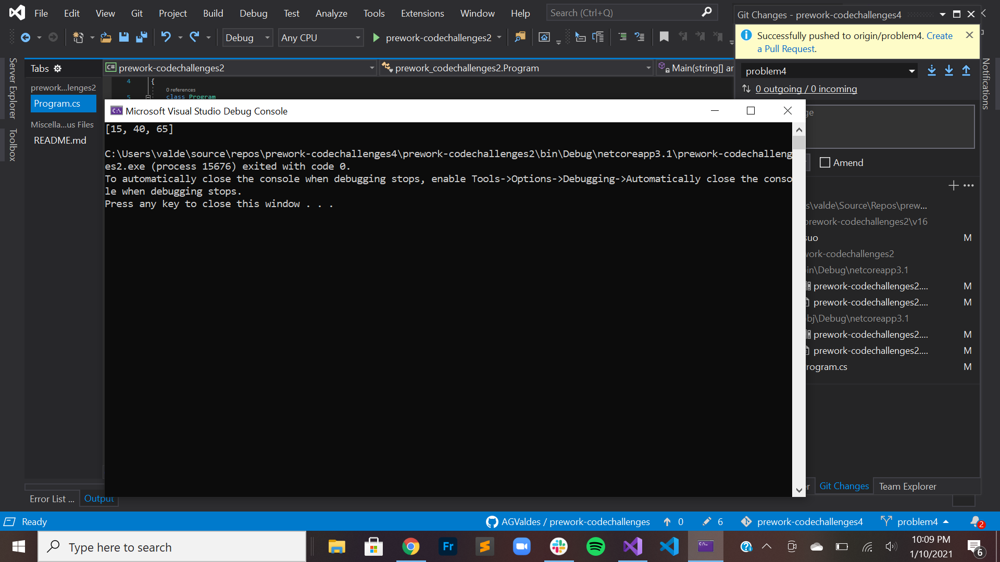

# prework-codechallenges

##Problem 1: Array Max Result
###Problem Statement
Given an array select a number that exists, and output the computated “score”. The method you create should take in both an array of integers and the integer the user selected.
Create a Console application that requests 5 numbers between 1-10 from the user. Output the array to the console and ask the user to select a number. After the selection, output the “score” of the number chosen.

##Problem 2: Leap Year Calculator
###Problem Statement
Given a year, report if it is a leap year.

##Problem 3: Perfect Sequence
###Problem Statement
Given an array, return “Yes” if the sequence is considered a perfect sequence. Otherwise, return “No”

##Problem 4: Sum of Rows
###Problem Statement
Given a matrix of integers. Return the sum of each row in a single dimensional array.
